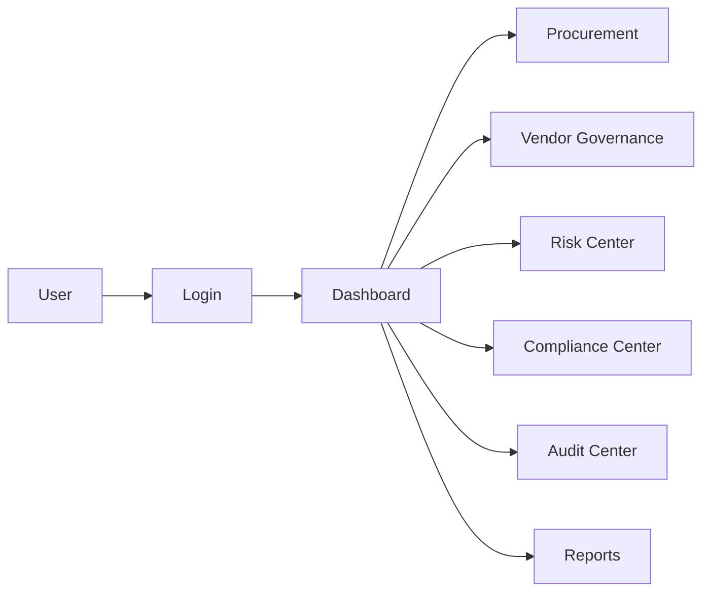

# Architecture Overview

## Modules
- Authentication
- Executive Dashboard
- Procurement Workspace
- Vendor Governance
- Risk Center
- Compliance Center
- Audit Center
- Reporting Center
- Settings

## Technical Stack
- React 19
- Vite
- Redux Toolkit
- React Router DOM
- Axios
- React Hook Form
- Yup
- Material UI
- Recharts
- Jest
- React Testing Library

## Flow

